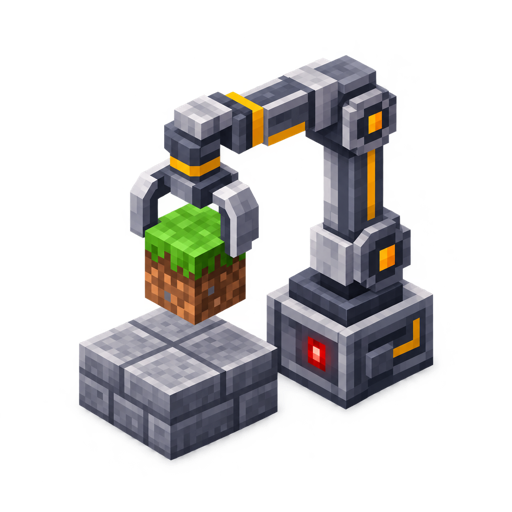

<div align="center">
  

# Minecraft Automation

Structured observation and verified Minecraft actions for Codex and other MCP clients.

[](https://github.com/zedoCN/minecraft-automation/actions/workflows/build.yml)
[](LICENSE)

[中文说明](docs/PROJECT.zh-CN.md) · [MCP setup](mcp-server/README.md) · [Architecture](docs/ARCHITECTURE.md) · [Security](SECURITY.md) · [Contributing](CONTRIBUTING.md)
</div>

A Fabric mod and local MCP server for navigating, handling inventory, operating interfaces and
building through a Minecraft player. The focus is useful work on servers that permit automation,
not bypassing server permissions.

Based on [MCP Fabric by Etoryx/dabinayo](https://github.com/Etoryx/mcpfabric), under the [MIT license](LICENSE).
The mod ID, Java namespace, configuration name and MCP connection name remain `mcpfabric` for
compatibility. Do not install both this fork and the upstream mod.

## Status

Primary development target: **Minecraft 26.2, Fabric Loader 0.19.3, Java 25**.
Other version nodes are inherited from upstream; their presence is not a compatibility guarantee.
This is an actively developed local fork, not yet a published stable release.

| Area | Current scope |
| --- | --- |
| Observation | Player/world/block state, inventory, entities, screenshots and catalog availability |
| Building | Precise placement, facing, sneaking, material selection, batching and confirmation |
| Navigation | Optional Baritone and built-in navigation; safety behavior differs by backend |
| Interfaces | Native/modded widgets, container slots, inventory transfers and generic GUI input |
| Development | Local admin operations and authenticated in-process Java, subject to capability gates |

Recorded local tests include survival rail/TNT duplicators, container workflows, anvil renaming
and industrial machine interactions. These are specific scenarios, not proof of arbitrary machines,
every mod UI or safe navigation in every world. Villager trading, moving entities on narrow
Baritone bridges and the latest shutdown cleanup need dedicated acceptance.
See [scope and limitations](docs/PROJECT.zh-CN.md).

## Quick start

1. Use Minecraft 26.2 with Fabric Loader and Fabric API.
2. Build from the repository root:

   ```sh
   ./gradlew :26.2:build -x test
   ```

   Put the non-sources jar from `versions/26.2/build/libs/` in the instance's `mods/` folder,
   replacing the previous `mcpfabric` jar.
3. Start Minecraft once to generate `config/mcpfabric.config.json`. Read [Security](SECURITY.md)
   and review its capability flags before connecting an agent.
4. Build the MCP service:

   ```sh
   cd mcp-server
   npm ci
   npm run build
   ```

5. Configure the MCP host to launch `node /absolute/path/to/mcp-server/dist/index.js` with:

   ```text
   MCPFABRIC_URL=http://127.0.0.1:25599
   MCPFABRIC_TOKEN_FILE=/absolute/path/to/minecraft/config/mcpfabric.config.json
   MCPFABRIC_TOOL_MODE=catalog
   ```

   See [host setup](mcp-server/README.md). Do not paste credentials into shared examples.

Baritone is optional, not bundled; install a compatible version separately. Catalog availability
reflects the current session. Builds are not equivalent to automated tests or gameplay acceptance.

## How it works

```text
Codex / MCP host
  -> Node.js MCP service (stdio)
  -> authenticated local HTTP bridge
  -> Fabric client / server main thread
  -> game actions and state readback
```

Default tools: `minecraft_status`, `command_catalog`, `command_describe`,
`command_describe_many`, `command_invoke`, `command_batch`.
Discover a command, read its schema, execute it and inspect its confirmation. Uncertain mutations
are not blindly retried.

Remote gameplay remains subject to server authority, reach, inventory and physics. Client-cache
confirmation is not authoritative server readback. Admin test preparation and creative editing
are separate from normal survival operation.

## Safety

Use only where the server owner permits automation. Keep the bridge on loopback, require
authentication and back up worlds before destructive tests.

**Development defaults enable powerful capability groups, including `enableUnsafeJava`.**
Review them explicitly. Java scratch inherits Minecraft's filesystem/network/process permissions;
it is not a sandbox. Disable capabilities you do not need. No safety guarantee is made for TNT,
valuable builds, void bridges or unattended gameplay.

## Layout

```text
src/main/        Common/server handlers and HTTP bridge
src/client/      Player, GUI, building and navigation
mcp-server/      TypeScript transport, catalog, schemas and tests
versions/        Per-version build configuration
docs/            Architecture, scope, assets and publishing
local/           Ignored worlds, test server, credentials and recovery artifacts
```

See [GitHub preparation](docs/GITHUB.md) and [releases](docs/RELEASING.md).
Source: [zedoCN/minecraft-automation](https://github.com/zedoCN/minecraft-automation).
Upstream Modrinth downloads do not contain this fork's changes.

## Attribution

Original code: MCP Fabric, copyright 2026 dabinayo. Local customization: zedoCN.
The original license and Git history are retained. The new icon is AI-generated; see
[prompt and provenance](docs/ASSETS.md). Not an official Minecraft or Mojang/Microsoft product.
